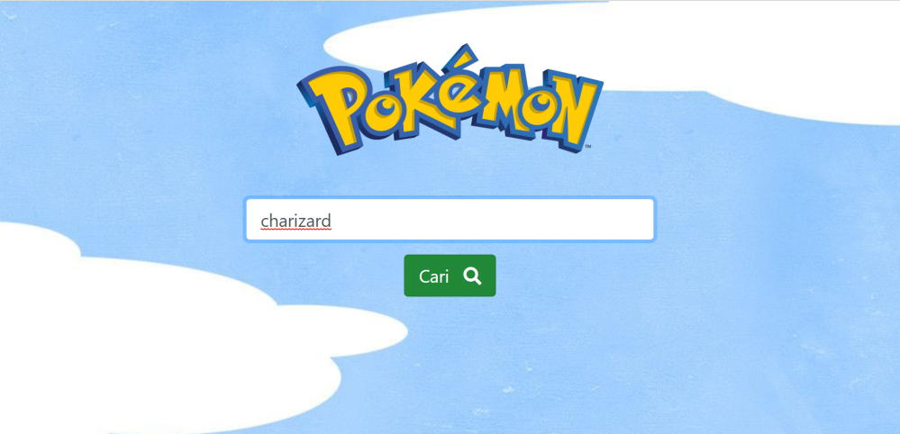
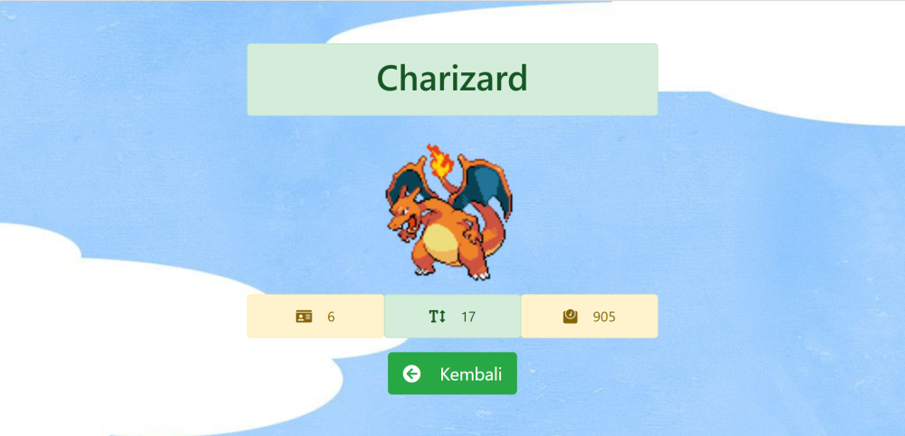
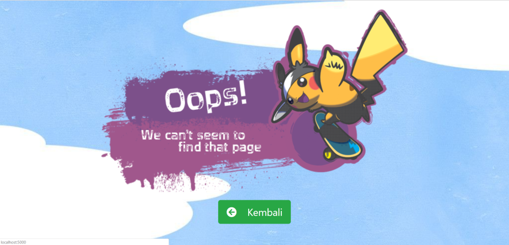

# Soal Ujian Python Data Science Fundamental

#

### **Soal 3 - Cari Pokemon**

Buatlah sebuah __aplikasi Flask__ yang dapat memfasilitasi user untuk mencari data __Pokemon__ dengan nama tertentu, memanfaatkan __Poke API__ ([_klik sini_](https://pokeapi.co/)). API endpoint yang digunakan adalah __GET__ ke https://pokeapi.co/api/v2/pokemon/{nama_Pokemon}. Aplikasi yang dibuat harus memenuhi syarat minimal berikut:

1. Server aplikasi akan berjalan di __localhost:5000__ dan ketika user melakukan GET request via browser akan tampil sebuah halaman __HTML__ sederhana yang memuat __1 buah text input__ dan __1 buah button__. Desain tampilan HTML tidak harus sama seperti contoh soal, utamakan fitur!

    

2. User dapat memasukkan nama Pokemon yang dicari ke dalam text input yang sudah disediakan. Saat user menekan tombol button, aplikasi akan mengambil data Pokemon yang dicari via Poke API: __GET__ ke https://pokeapi.co/api/v2/pokemon/{nama_Pokemon}.

    

3. Jika data ditemukan, maka user akan di-redirect ke __localhost:5000/hasil__ yang berisi halaman __HTML__, yang menampilkan data seputar Pokemon yang dicari. Data yang ditampilkan hanya: __nama Pokemon__, __gambar depan Pokemon__, __nomor id Pokemon__, __tinggi badan Pokemon__ & __berat badan Pokemon__. Halaman ini juga dilengkapi __1 buah button__ untuk kembali ke halaman awal. Desain tampilan HTML tidak harus sama seperti contoh soal, utamakan fitur!

    

4. Namun jika data tidak ditemukan atau tidak ada di dalam database Poke API, maka user akan di-redirect ke halaman __HTML__ yang memberikan informasi bahwa data tidak ditemukan. Halaman ini juga dilengkapi __1 buah button__ untuk kembali ke halaman awal. Desain tampilan HTML tidak harus sama seperti contoh soal, utamakan fitur!

    

_**Catatan:**_

⚠ Poke API memiliki batasan __100 API request per IP address per menit__. Jika Anda mengalami kendala dikarenakan telah mencapai limit, maka tunggulah sejenak beberapa menit, lalu coba call API kembali.

✅ _Commit & push source code jawaban soal ini ke __Github__ Anda, buatlah repo dengan nama __Ujian_Cari_Pokemon__, kemudian lampirkan __url link repo Github__ Anda via email ke lintang@purwadhika.com!_

#

### *__#HappyCoding__* :relaxed:

#### Lintang Wisesa :love_letter: _lintangwisesa@ymail.com_

[Facebook](https://www.facebook.com/lintangbagus) | 
[Twitter](https://twitter.com/Lintang_Wisesa) |
[Google+](https://plus.google.com/u/0/+LintangWisesa1) |
[Youtube](https://www.youtube.com/user/lintangbagus) | 
:octocat: [GitHub](https://github.com/LintangWisesa) |
[Hackster](https://www.hackster.io/lintangwisesa)